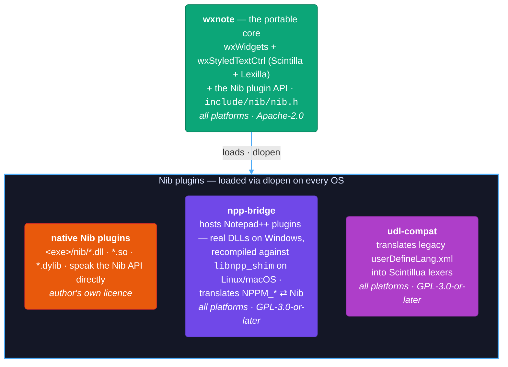

# wxNote Architecture

How the editor is put together. Product identity: CMake project `wxNote`,
executable/package name `wxnote`, internal code prefix `wxn` (macros, C++
identifiers, IPC/config strings). Core is Apache-2.0; the two optional interoperability
modules `packages/npp-bridge/` (Notepad++ plugin ABI) and `packages/udl-compat/` (legacy
UDL import) are GPL-3.0-or-later (see [`LICENSING.md`](../LICENSING.md)).

## The one-picture version

One portable core and one portable plugin API on every OS. The two
Notepad++-compat modules are **themselves just Nib plugins**, loaded like any
other: **`npp-bridge`** hosts Notepad++ plugins — real compiled DLLs on Windows,
plugins recompiled against `libnpp_shim` on Linux/macOS — and translates
`NPPM_*` ⇄ Nib; **`udl-compat`** translates legacy `userDefineLang.xml` into the
core's Scintillua engine (see *Custom languages* below). Both are optional and
GPL-3.0-or-later, so the Apache-2.0 core never depends on either.

## How wxNote differs from Notepad++

wxNote is a **from-scratch reimplementation**. The current source tree shares
**no Notepad++ implementation code** — it reproduces only *behavior*, command-id
*values*, and file *formats*, and only where interoperability actually requires
it (the licensing framework and the full disclosed-compatibility surface are in
[`LICENSING.md`](../LICENSING.md)). Being honest about provenance, though: the
repository's *git history* is a genuine Notepad++ fork — the project began as a
CMake build-port of real N++ source, then the wxWidgets rewrite replaced that
source entirely. The Apache-2.0 relicense covers the current tree's contents, not
that history. Two prior structural ties have since been removed too: the
command-id table (`src/command_ids.h`) was regenerated as original `kCmd*`
constants over the frozen ABI values, and the within-menu item ordering was
reorganized into wxNote's own scheme — so what deliberately coincides now is only
the frozen id *values*, the `include/npp-compat/` ABI facts (consumed solely by
the GPL modules), file-format field names, and shared command labels.

Architecturally, the two programs diverge on nearly every axis:

| Axis | Notepad++ | wxNote |
|---|---|---|
| Platforms | Windows only (a Win32 program) | Windows, Linux, macOS from one codebase |
| UI toolkit | raw Win32 / GDI, resource-script dialogs, the Windows message loop | wxWidgets — real native controls on each OS |
| Editing engine | Scintilla + Lexilla | **the same**, via `wxStyledTextCtrl` |
| Plugin ABI | Win32 DLLs speaking `NPPM_*` window messages over real `HWND`s | **Nib** — an original, portable C ABI; N++ plugins via an optional GPL bridge (real DLLs on Windows, recompiled against a shim on Linux/macOS) |
| Custom languages | UDL: flat keyword lists + delimiter pairs | **Scintillua** (Lua LPeg grammars) as the native engine; UDL demoted to an optional GPL compat plugin |
| Licence | GPL v3 | Apache-2.0 core; GPL confined to the optional interop modules |
| Build / config | MSBuild + Visual Studio solution; `config.xml` | CMake + Ninja; `wxConfig` (registry / dotfile) |

The rest of this section is the deep dive behind that table.

### Toolkit and platform model — the reason a port was impossible

Notepad++ is not a cross-platform program with a Windows build; it is a
**Win32 program**. Its dialogs are Windows resource scripts, its docking, tab
bar, and toolbar are custom Win32/GDI code, and its behavior is wired through
the Windows message loop — the only genuinely portable pieces are the ones it
borrows, Scintilla and Lexilla. wxNote keeps exactly those borrowed pieces
(via `wxStyledTextCtrl`, which embeds the very same Scintilla) and rebuilds
everything else on **wxWidgets**, which maps to the platform's *own* widgets —
Win32 on Windows, GTK on Linux, Cocoa on macOS. A wxNote menu or file dialog
is the real native one. This is why wxNote could never have been a port:
porting would have meant rewriting every UI and platform file anyway, so a
clean-room rewrite that keeps only the portable engine was the strictly better
deal (the full argument is in [`GOALS.md`](GOALS.md)).

### Plugin architecture — Nib versus the Win32 message ABI

Notepad++'s plugin ABI is **Win32 by definition**: a plugin is a DLL that
receives real window handles (`NppData`) and communicates by sending
`NPPM_*`/`SCI_*` window messages. There is no portable seam to reimplement
behind, which is why no Notepad++ plugin can load unmodified off Windows.

wxNote's own plugin surface, **Nib** ([`include/nib/nib.h`](../include/nib/nib.h)),
is the opposite by design: a versioned, capability-negotiated C ABI where a
plugin queries the host for interface tables by *string id* (`nib.editor`,
`nib.commands`, `nib.langdef`, …) and no `HWND` or window message appears in
the contract. Nib plugins are ordinary shared libraries loaded by `dlopen`
on all three platforms. Real Notepad++ plugins are supported through the
optional GPL **npp-bridge** (itself just a Nib plugin): on Windows it loads the
compiled plugin DLLs unchanged; on Linux/macOS it runs plugins **recompiled**
against a small shim (Phase 2 — see "Plugins" below). Either way it rebuilds the
`NppData` environment and translates `NPPM_*` ⇄ Nib on the plugins' behalf.

### Custom-language definitions — Scintillua replacing UDL

Notepad++'s User-Defined Languages are a deliberately simple model: named
keyword lists (`Keywords1`..`Keywords8`), delimiter pairs, and a fixed set of
style slots, lexed by N++'s own container lexer. wxNote once shipped a
file-compatible version of that model in the core — that has now been
**replaced**.

wxNote's *native* engine is **[Scintillua](https://github.com/orbitalquark/scintillua)** —
MIT Lua LPeg lexers, a real grammar engine (regex, nested/embedded languages,
~160 bundled lexers) purpose-built for Scintilla, far more capable than UDL's
flat lists. The Apache-2.0 core (`src/scintillua_engine.{h,cpp}`, embedding Lua
+ LPeg + Scintillua) now contains **no UDL format code at all**; it just
container-lexes registered Scintillua languages on `STYLENEEDED`. That same pass
also drives **code folding**: `Engine::lexAndFold()` reuses the single lex to run
Scintillua's `lexer:fold()`, and the host applies the returned per-line levels
via `SCI_SETFOLDLEVEL` (idempotently, so re-lexing on a tab switch preserves the
user's collapse state). Grammars that declare no fold points simply don't fold.
Legacy Notepad++ `userDefineLang.xml` files are supported only through the
optional GPL **`packages/udl-compat/`** plugin, which translates each into a
Scintillua lexer and registers it via `nib.langdef`; its translator emits fold
points from N++'s `Folders in code`/`in comment` keywords, so UDL-derived
languages fold too. *Status:* **implemented and building green; the core's own
legacy UDL engine (`udl.h`/`udl_lexer.h`) and its editor dialog have been
removed.** Every runtime component is verified headlessly (engine lexes *and
folds* a translated UDL; the built plugin DLL loads, scans, translates and
registers; the generated Lua lexes under real Scintillua). Remaining
translator-fidelity gaps: nested delimiters, per-slot font styling, and
depth-neutral `middle` fold keywords (else/elif sub-folding). The one thing not
eyeball-confirmed is the rendered colours in a live GUI.

Scintillua was chosen after surveying nine candidate formats (GtkSourceView,
TextMate/Sublime grammars, tree-sitter, Chroma, Monarch, …): it is the only one
that is uniformly MIT-licensed, Scintilla-native (no separate rendering runtime),
and expresses real recursive grammars with embedded languages — a decisive step
up from UDL's flat keyword lists — while keeping the embedded Lua as a reusable
asset for future scripting.

### Menus, commands, and file formats — compatibility without imitation

wxNote's menu bar is an **original 11-menu hierarchy** (File, Edit, Selection,
Go, View, Document, Automation, Extensions, Settings, Window, Help) designed
from research across five editors — not Notepad++'s 13-menu layout. The numeric
`kCmd*` command-id *values* are the one thing kept identical to
Notepad++, and only because a bridged N++ plugin's `NPPM_MENUCOMMAND` carries
one of those numbers; the id *names*, table formatting, top-level grouping, and
the *within-menu* item ordering (an original frequency/affinity scheme) are all
wxNote's own (see "Command dispatch" and "The menu system"). The same
principle governs data files: wxNote *reads* Notepad++'s theme, session, and
workspace formats so real N++ files load unmodified, but *writes* its own
`<wxNote>` root element — compatibility inbound, its own identity outbound.
(Legacy `userDefineLang.xml` files are the one exception the core no longer
parses at all: that format now lives solely in the optional GPL
`packages/udl-compat/` plugin, which translates them to Scintillua lexers.)

### Licensing and provenance

Notepad++ is GPL v3. wxNote's **core is Apache-2.0**; the *only* GPL parts are
the optional interop modules — `packages/npp-bridge/` and
`packages/udl-compat/` — precisely because those are the pieces that
deliberately reproduce a Notepad++ ABI or file format. The project was itself
GPL v3 through v0.6.2 and relicensed only after every Notepad++-derived file
had been replaced or clean-room reimplemented and the ABI reproduction isolated
into that one optional module. The reasoning and the per-component record are
in [`LICENSING.md`](../LICENSING.md).

## Source layout

| Path | Role |
|---|---|
| `src/main.cpp` (~9,000 lines) | The application: app object, frame, editor views, all panels and dialogs, theme engine, dispatcher, plugin host. Apart from the two per-platform shims and the sample plugin below, everything else in `src/` is a header it includes. |
| `src/menu_model.h`, `src/menu_builder.h`, `src/menu_data_*.h`, `src/menu_labels_*.h` | The data-driven menu engine (below). |
| `src/scintillua_engine.h`, `src/scintillua_engine.cpp` | The native language engine: embeds Lua + LPeg + Scintillua to lex buffers with dynamically-registered Scintillua lexers (see Custom languages below). |
| `src/terminal_panel.h` | The integrated multi-tab terminal panel and the per-platform shell/terminal-app detection. |
| `src/gtk_native.cpp`, `src/macos_native.mm` | Small per-platform native shims for things wxWidgets doesn't expose (GTK scrollbar theming; macOS title-bar/traffic-light work). Compiled only on their platform, gated in CMake. |
| `src/app_icon_svg.h` | The app icon as an embedded SVG string, rendered at runtime via `wxBitmapBundle::FromSVG`. |
| `src/command_ids.h` | The core's own, authoritative command-id table. Values are frozen (static_asserts) so they stay identical to the plugin ABI's ids and npp-bridge's command passthrough dispatches correctly. |
| `include/nib/nib.h` | The Nib plugin API — an original, stable C ABI (below). |
| `include/npp-compat/` | Clean-room redeclarations of the Notepad++ plugin-ABI facts (ids, struct layouts). Consumed only by `packages/npp-bridge/` and `packages/test_plugin/` — the core includes nothing from here. |
| `packages/npp-bridge/` | The optional GPL Notepad++ binary-plugin bridge (itself a Nib plugin; builds on every OS — loads real plugin DLLs on Windows, shim-recompiled `.so`/`.dylib` plugins on Linux/macOS). |
| `packages/udl-compat/` | The optional GPL Notepad++ UDL compatibility plugin: reads legacy `userDefineLang.xml`, translates each into a Scintillua Lua lexer, and registers it via `nib.langdef`. Ships `bin/nib/udl_compat.dll`, a standalone `udl2scintillua` converter CLI, and unit + roundtrip tests. Scoped to move to its own repository. |
| `packages/test_plugin/` | A minimal real-ABI Notepad++ plugin used as the bridge's regression fixture (Windows-only, GPL). |
| `src/plugins/nib_test_plugin/` | A cross-platform reference/smoke-test Nib plugin (Apache-2.0). |
| `third_party/` | Vendored: Lexilla (lexers, HPND), Scintilla headers (HPND), wxBorderlessFrame (wxWindows Licence). |
| `resources/` | Icons (3 sets), themes, default styler, fonts, locale catalogs, app icon, `app.rc`. |
| `installer/`, `.github/workflows/` | Per-platform packaging (NSIS / AppImage+deb+rpm+flatpak / dmg) and the CI/release pipelines. |
| `site/` | The project website (GitHub Pages). |

## Application core

`WxnApp : wxApp` owns startup: a hidden `--elevated-write` UAC helper mode
(Windows), the one-time settings migration from the legacy config key into
`"wxNote"`, command-line parsing (`-g/--goto`, `-e/--encoding`,
`-n/--new-instance`, `-r/--reuse-instance`, files), the single-instance
handoff, font/locale setup, and frame construction.

The main window is a template, `WxnShellFrameT<FB>`, instantiated two ways:

- `WxnShellFrameT<wxFrame>` — native OS chrome;
- `WxnShellFrameT<wxBorderlessFrame>` (only where `WXN_HAS_BORDERLESS` is
  defined: Windows and Linux) — the integrated top bar, where the menu
  buttons, toolbar, and custom min/max/close controls live in one row. The
  "System-native window buttons" preference keeps a single bar but gives its
  buttons a platform-native identity: on Windows the bar/buttons become
  hit-test-transparent so the OS gets real `HTCAPTION`/`HT*BUTTON` codes (snap
  layouts, native drag); on Linux the whole menu panel is re-parented into
  wxbf's own `GtkHeaderBar` (via `src/gtk_native.cpp`'s `wxn_HostInHeaderBar`),
  so GTK draws the desktop theme's real min/max/close on the right — the
  wx-sanctioned whole-widget move, the same one wx uses to host controls in
  `wxToolBar`. On
  macOS the same integrated look is achieved differently: the frame stays a
  `wxFrame` and `src/macos_native.mm` makes the native title bar transparent
  and re-centres the traffic lights into the toolbar row.

Which one is built is a restart-to-apply preference; `if constexpr` on the
base type gates the integrated-bar code paths.

## Editor model: two views, one control each

An editor "view" (`ViewPane`) is a tab strip (`wxAuiNotebook`) plus **one**
persistent `wxStyledTextCtrl`. Each tab (`EditorPage`) holds a Scintilla
*document pointer* and per-tab state (path, dirty flag, language, encoding,
tab colour, monitoring state…), not its own editor control — activating a tab
swaps the document into the view's single control via `SCI_SETDOCPOINTER`.

There are two views, MAIN and SUB, in a splitter: Move/Clone to Other View
populates the second; it collapses when emptied. `m_tabs`/`m_stc` are aliases
re-pointed at whichever view has focus, so most code follows focus without
caring which view it's in; cross-view operations iterate `allPages()`.

## Panels

Everything dockable is a `wxAuiManager` pane around the central splitter:
Document Map (a second Scintilla sharing the active document), Function List
(regex-derived symbol tree for C/C++, Python, JS/TS, Java, C#, Go, Rust,
Lua), Document List, Clipboard History, Character Panel, Project Panel
(N++-compatible workspace XML — writes a `<wxNote>` root, reads either
`<wxNote>` or N++'s own `<NotepadPlus>` root), Folder as Workspace, the
incremental-search bar, Find-in-Files results, the integrated Terminal
(lazy-created, multi-tab, per-platform shell detection), and — in integrated
mode — the title bar and toolbar rows themselves. Nib plugins can register
additional text panels (and, on Windows, dock native HWNDs).

## Command dispatch

One handler receives every menu/toolbar command and switches on the id.
Standard commands use the numeric `kCmd*` ids from the core's own
`src/command_ids.h` (original names; only the *values* are kept identical to
Notepad++'s `IDM_*` numbers) — an original table whose *values* are frozen identical
to the plugin ABI's ids (static_asserts enforce it), so commands invoked by
bridged Notepad++ plugins land correctly. Because those ids exceed 32767 and
Win32's WM_COMMAND carries a 16-bit value, the handler reads the id as
unsigned 16-bit (a sign-extension trap), and an `MSWWindowProc` override
re-dispatches native toolbar clicks that wx's signed-short lookup would
otherwise drop. App-local ids live at 60000+; Nib plugin commands at 63000+.

## The menu system

Menus are **data, not code**: each top-level menu is a `static const
MenuItemDef[]` table (`menu_data_*.h`) of `{kind, id, label-getter,
symbolic-name}` rows; labels are one-line functions containing real `_()`
calls (`menu_labels_*.h`) so gettext extraction keeps working. A ~100-line
builder walks the tables into a `wxMenuBar` once at startup and records a
`MenuRegistry` of symbolic names → menus and `DynamicSlot` insertion points
(Recent Files, the Language A–Z tree, UDL entries, macros, Open-Containing-
Folder tools, plugin commands) — no lookups by translated label text
anywhere. The hierarchy itself is an original 11-menu structure (File, Edit,
Selection, Go, View, Document, Automation, Extensions, Settings, Window,
Help) designed from research across five editors; it does not mirror
Notepad++'s. The item ordering *within* each menu is likewise wxNote's own
frequency/affinity arrangement (View leads with panels, Edit submenus ordered
by frequency, Go/Search re-clustered) rather than Notepad++'s — only the frozen
command-id values and the shared command labels coincide.

## Theming

`WxnTheme` parses the `<NotepadPlus>` theme-XML *format* — Notepad++'s own
schema, kept so real N++ theme files load unmodified. Of the 27 themes
shipped, 14 are wxNote's own regenerated data (Apache-2.0, including both
defaults) and 13 are kept third-party themes under their original authors'
licenses (see [`docs/CREDITS.md`](CREDITS.md)). Light default is
`stylers.model.xml`; dark default is `themes/DarkModeDefault.xml`. App-wide dark/light follows the OS by default (System /
Dark / Light, restart-to-apply, relaunching through a session save). The
Style Configurator edits the active theme XML in place.

## Persistence

- **Settings** — `wxConfig` under app name `"wxNote"` (registry on Windows,
  dotfile elsewhere).
- **Session** — reopened automatically from config on launch; File > Save/
  Load Session additionally reads/writes Notepad++-style `<Session>` XML
  (caret, scroll, bookmarks included) — wxNote writes a `<wxNote>` root and
  reads either `<wxNote>` or N++'s own `<NotepadPlus>` root.
- **Recovery** — unsaved changes discarded at exit are backed up to
  `<user-data-dir>/RecoveryBackups/` and offered back on next launch.
- **User data vs. install dir** — everything the app *writes* (recovery,
  UDLs, edited `contextMenu.xml`) goes to `wxStandardPaths::GetUserDataDir()`;
  the install dir (Program Files, `/opt/wxnote`, the `.app` bundle) is
  treated as read-only and holds only shipped resources.

## i18n

`wxLocale` with catalog `wxn`, loaded from `<exe>/locale/`. Eight languages
ship (pl, de, fr, es, ru, ja, zh, ko); English is the source text.
`tools/po2mo.c` (built as the optional `po2mo` CMake dev target) is a
self-contained `.po` → `.mo` compiler (the GNU gettext *format*, no gettext
tooling dependency); compiled catalogs are committed and deployed by the
build's resource-copy step.

## Custom languages (Scintillua)

The core has **no built-in user-defined-language format of its own** and no
Notepad++ UDL code. Custom languages come from `src/scintillua_engine.{h,cpp}`,
which embeds Lua + LPeg + Scintillua: a plugin registers a language by handing
the host a Scintillua lexer (Lua source) through `nib.langdef`; the host stores
it, lists it in the Language menu, auto-detects it by file extension, and
container-lexes matching buffers on `wxEVT_STC_STYLENEEDED` (mapping Scintillua
tags to Scintilla styles). Legacy Notepad++ `userDefineLang.xml` files are
supported only through the optional GPL `packages/udl-compat/` plugin, which
translates each into a Scintillua lexer and registers it — the core never sees
the N++ UDL format.

## Plugins: Nib, and the Notepad++ bridge

**Nib** (`include/nib/nib.h`) is wxNote's own plugin API — an original,
cross-platform, stable C ABI that borrows nothing from Notepad++ (no
`NPPM_*`, `FuncItem`, `NppData`, `HWND` in the contract). A plugin is a
shared library exporting one entry point; it queries the host for versioned,
length-prefixed interface tables by string id (`nib.host`, `nib.editor`,
`nib.documents`, `nib.commands`, `nib.events`, `nib.panels`, `nib.langdef`
(register a Scintillua language), `nib.paths` (the per-user data dir), `nib.sci`
(a raw Scintilla-message passthrough, offered on every OS), and the
capability-gated, Windows-only `nib.win32`). Interfaces grow additively;
plugins load from `<exe>/nib/`.

**npp-bridge** (`packages/npp-bridge/`, GPL) makes real Notepad++ plugins work.
It is itself a Nib plugin that surfaces each `FuncItem` as a Nib command,
answers `NPPM_*` messages by translating them to Nib calls, and forwards Nib
events back as `SCNotification`s. The dependency rule that keeps the license
boundary clean: the core knows nothing about the N++ ABI — it includes nothing
from `include/npp-compat/`, and its own `src/command_ids.h` merely keeps its id
*values* aligned with the ABI's; all N++-derived knowledge flows downward into
the bridge, and new plugin needs are met by adding *generic* Nib capabilities
the bridge then adapts. The bridge is slated to move into its own repository.

The bridge reaches a plugin two ways:

- **Windows — load the compiled DLL.** It uses `nib.win32` to obtain native
  handles, rebuilds the `NppData` environment, `LoadLibrary`s
  `<exe>/plugins/<Name>/<Name>.dll`, and intercepts the plugin's own
  `SendMessage(hwnd, NPPM_*/SCI_*)` calls by subclassing the frame HWND. This
  is the mature path — real binary plugins run unmodified.

- **Linux/macOS — recompile against a shim** (*cross-platform plugins, Phase 2
  shipped in 0.8.5; not yet runtime-verified on real Linux/macOS hardware*). A
  Windows PE DLL can't load off-Windows, so instead the plugin
  author recompiles their **source** against a small GPL static lib,
  `libnpp_shim` (`packages/npp-bridge/shim/`). The plugin's unchanged
  `SendMessage(handle, msg, w, l)` links to the shim, which routes into the same
  portable dispatcher the Windows path now uses: `SCI_*`/Lexilla ranges go
  through the core's generic `nib.sci/1` capability into
  `wxStyledTextCtrl::SendMsg`, and `NPPM_*` messages go through the same
  `bridge_handleNppm` switch. The core exposes **no** Win32 or N++ concepts for
  this — `nib.sci/1` is a plain "run a Scintilla message" passthrough offered on
  every OS. Scope note: this covers plugins whose host interaction is the
  `NPPM_*`/`SCI_*` message surface (the portable majority). Plugins that draw
  raw Win32 dialogs / GDI, or that vendor Notepad++'s `DockingFeature`
  framework, remain out of scope so far — their UI layer needs a separate port.

  Because the dev toolchain is Windows-only, most of this is verified by
  **CI compilation** on the Linux/macOS legs plus the fact that the *Windows*
  bridge now runs through the identical `nib.sci/1` tail (so real Windows
  plugins exercise the shared dispatch). The remaining unverified step — a real
  recompiled `.so`/`.dylib` resolving the shim symbol and driving the editor at
  runtime — needs an actual Linux/macOS machine and a real ported plugin.

## Platform shims

- `src/gtk_native.cpp` (Linux) — installs a maximum-priority GTK CSS provider
  that neutral-themes scrollbars and scrolled-window decoration nodes (so
  desktop accent themes don't paint over the editor edge) and compacts
  toolbar metrics. Notable constraint: GTK3's CSS parser has no `!important`;
  provider priority is the only lever.
- `src/macos_native.mm` (macOS) — hides the native window title, implements
  the integrated top bar (transparent titlebar + full-size content view +
  re-centred traffic lights, re-applied after resize/restore), and starts
  native window drags from the toolbar row.

## Build & packaging

CMake fetches and statically builds wxWidgets 3.3.1 at configure time, builds
vendored Lexilla and (Windows/Linux) wxBorderlessFrame as static libs, and
produces the single `wxnote` executable plus the plugin modules. A POST_BUILD
step copies all runtime resources (icons, themes, fonts, locale, styler,
context menu) next to the executable — the layout every installer then ships
as-is (no FHS split). CI builds and packages on all three OSes — with
separate x64 and ARM64 legs for Windows and Linux (native arm64 runners; the
packaging scripts detect the build host's architecture themselves), plus a
cross-compiled `linux-riscv64` leg that packages a `.deb` — for every pull
request and for source-affecting pushes to master; pushing a `v*` tag
assembles a GitHub Release with the NSIS installers (x64 + ARM64), the four
Linux package formats in both x86_64 and aarch64, an additional riscv64
`.deb`, and both macOS `.dmg`s (13 assets).
